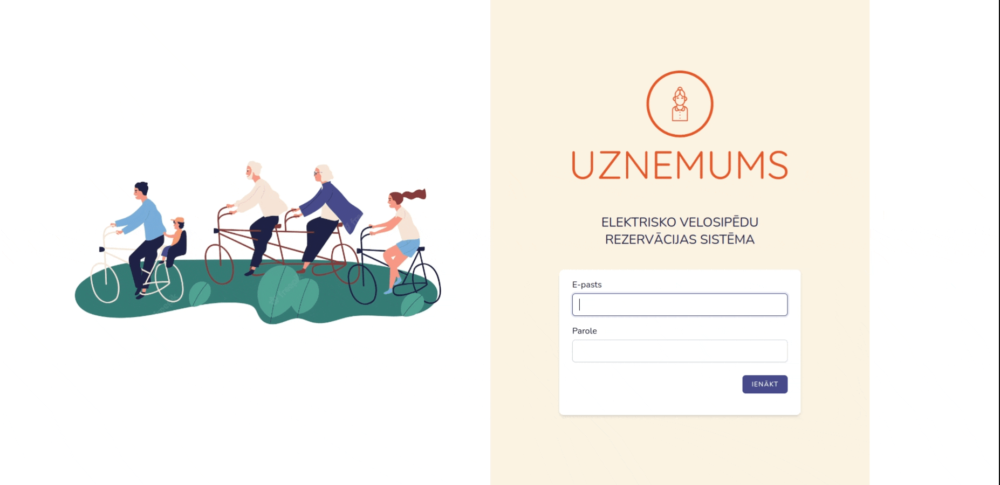

### Elektrisko velosipēdu rezervācijas sistēma

Šī sistēma ļauj uzņēmuma darbiniekiem:
- ienākt sistēmā ar savu e-pastu un paroli (jaunu lietotāju reģistrācija klienta pusē nav iespējama);
- veikt velosipēda rezervāciju, norādot datumu un izvēloties no pieejamajiem velosipēdiem;
- saņemt atgādinājuma e-pastu dienu iepriekš (atgādinājums tiek sūtīts uz e-pastu, ar kuru darbinieks ielogojas sistēmā);
- apskatīt visas rezervācijas;
- filtrēt rezervācijas pēc datumiem un atlasītos datus drukāt PDF formātā;
- apskatīt visas savas rezervācijas;
- e-pastā ir iespēja atcelt rezervāciju.

Tehnoloģijas:

- Laravel Framework 9.34.0;
- PostgreSQL;
- Front-end: Laravel Blade;
- jQuery.

Darba apskate:

- nokopēt .env.example failu un ievietot savus:
  - `DB_USERNAME`;
  - `DB_PASSWORD`;
- izveidot datubāzi "reservations_system";
- terminālī palaist komandas:
  - `npm install`;
  - `pg_dump reservations_system < reservations_system.sql ` (izveidos tabulas un ievietos tajās datus);
  - `npm run dev`;
  - (jaunā terminālī) `php artisan serve`;
- lai pārbaudītu testus: `php artisan test`.

Lai ielogotos sistēmā:
e-pasts: darbinieks<1-16>@uznemums.lv;
parole: 12345678

